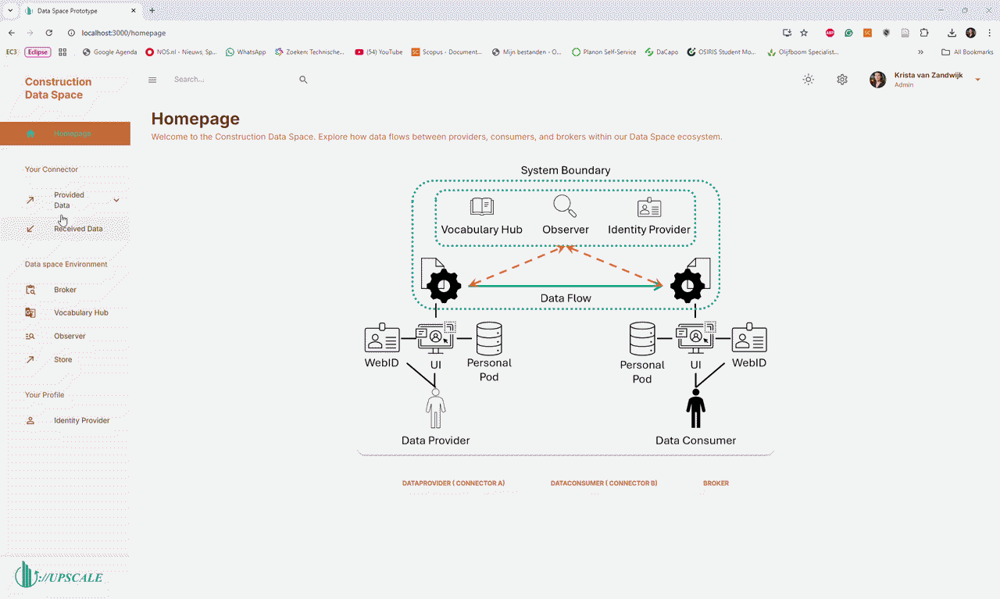

# Exploring Minimum Viable Data Spaces

This GitHub Repository includes the front-end code that is built on top of the Minimum Viable Data Space (MVDS) of the International Data Space Association (IDSA). The goal of this front-end is to make the backend processes that happen within a data space more transparant and understandable for non-technical stakeholders. This code is part of a scientific research that has been submitted to the 5th 4TU-14UAS Research Day on Digitalization of the Built Environment. A link to the conference paper will be added once it has been published (the paper is currently under review).

Part of the research is the conceptualization of the MVDS code, using use case, sequencce and entitiy relationship diagrams. As part of the research, the MVDS codebase was conceptually analyzed and modeled using use case diagrams, sequence diagrams, and entity–relationship diagrams. The study considers both the MVDS implementation by Eclipse Foundation and the specifications provided by the International Data Spaces Association. While the conference paper discusses these conceptual models specifically focussing on the Eclipse MVDS, space limitations prevented the inclusion of all diagrams. Therefore, this repository provides the complete set of diagrams, which are included below for reference.

## 1. The IDSA MVDS
The first Minimum Viable Data Space (MVDS) considered in this research is the implementation provided by the International Data Spaces Association (IDSA). This part of the study is based on the code made available by IDSA, which can be accessed through their GitHub repository: https://github.com/International-Data-Spaces-Association/IDS-testbed.

A schematic overview of the components in this MVDS is shown below. 

### 1.1. Use Case Diagrams

For the IDSA MVDS, four primary use cases can be identified: (1) verification, validation, and registration of the MVDS components; (2) registration of resources at the connector by the data provider; (3) discovery of data within the data space by the data consumer using the broker component; and (4) negotiation and exchange of data between the data provider and the data consumer.

For each use case, a dedicated use case diagram has been developed and is presented below.

#### 1.1.1. Verification, Validation and Registration

#### 1.1.2. Data Offering

#### 1.1.3. Data Discovery

#### 1.1.4. Data Negotiation and Exchange

### 1.2. Sequence Diagrams
Next, sequence diagrams are developed to illustrate the interactions between the components within the data space for each use case. In total, three sequence diagrams are created for the IDSA MVDS. The first diagram depicts how resources are registered in the data space. The second illustrates how data consumers discover available resources. The third demonstrates how data negotiations are initiated and confirmed, ultimately leading to the actual data exchange.

The three sequence diagrams are presented below.

#### 1.2.1. Data Offering

#### 1.2.2. Data Discovery

#### 1.2.3. Data Negotiation and Exchange

### 1.3. Entity Relationship Diagram
Finally, an entity–relationship diagram has been developed to provide a clear structural overview of the system. This diagram illustrates the relationships between the core components of the data space and the created data offers, including their representations and associated contracts. It clarifies how the various entities and components are interconnected within the IDSA MVDS.

## 2. The Eclipse MVDS
The second MVDS considered in this research is the implementation provided by the Eclipse Foundation. Their code is publicly available through the following GitHub repository:https://github.com/eclipse-edc/MinimumViableDataspace

The components that constitute this MVDS are illustrated in the figure below.

### 2.1. Use Case Diagrams
The Eclipse MVDS is pre-seeded, meaning that participating components are provisioned and configured in advance. As a result, users are not required to register their components with an identity hub themselves. All components are already verified and provided with the necessary security credentials to operate within the data space.

Because identification, verification, and registration are handled beforehand, these steps are no longer part of the operational workflow. Consequently, unlike the IDSA MVDS, no separate use case is required for verification, validation, and registration.

For the Eclipse MVDS, three primary use cases remain: (1) data provisioning, (2) data discovery, and (3) data negotiation and exchange. These use cases correspond to the core functional interactions within the data space and reflect the activities that occur after the initial trust establishment has already been completed. The use case diagrams for each of these scenarios are presented below.

#### 2.1.1. Data Offering

#### 2.1.2. Data Discovery

#### 2.1.3. Data Negotiation and Exchange

### 2.2. Sequence Diagrams
Next, a sequence diagram has been developed for each use case to illustrate the interactions between the involved components. These diagrams are presented below.

#### 2.2.1. Data Offering

#### 2.2.2. Data Discovery

#### 2.2.3. Data Negotiation and Exchange

### 2.3. Entity Relationship Diagram
Finally, an entity–relationship diagram has been developed for the Eclipse MVDS. This diagram illustrates how an asset is related to its associated access and usage policies, as well as how it is related to the shared and private catalogs. The Figure is shown below.

## 3. User Interface Prototype
The purpose of this research is to conceptualize the MVDS code in a way that makes data spaces more transparent and understandable, particularly for non-technical actors. Currently, both MVDSs only provide a backend interface that can be accessed via Postman, which makes the processes abstract and difficult to grasp. As a result, data space users often lack clarity about how their data is being used, to what extent, and who has access within the data space. To address this, a mockup of a potential user interface has been developed on top of the IDSA MVDS. This prototype can help demonstrate to users how their data offers are processed. A short video of the user interface prototype is shown below. One can run this frontend themselves by cloning this GitHub repository.

## 4. Conclusion

This GitHub repository provides a front-end built on top of the Minimum Viable Data Spaces (MVDS) from the International Data Spaces Association (IDSA), aimed at making data space processes more transparent for non-technical users. It includes conceptual analyses of both MVDS implementations through use case, sequence, and entity–relationship diagrams, complementing a related research paper. 

## Acknowledgements
This work is supported by the UPSCALE project, funded by the Dutch Organization for
Scientific Research (NWO). For more information, visit the website https://upscaleproject.nl/ or https://www.nwo.nl/en/projects/kich1ed0722014.

If you use this work, please cite it as: 